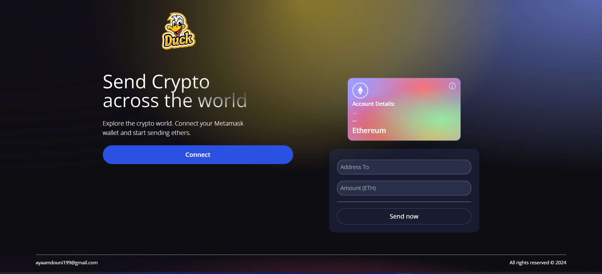

# Getting Started with Send Crypto App

The project demo is available in this link:
https://send-crypto-xwe4.vercel.app/

This project aims to send crypto across the world by providing the address of the receiver and the amount to be sent

## Available Scripts

In the project directory, you can run:

### `npm start`

Runs the app in the development mode.\
Open [http://localhost:3000](http://localhost:3000) to view it in your browser.

#### you will something similar to this: 

The page will reload when you make changes.\
You may also see any lint errors in the console.

## Contributing

Contributions to this repository are highly encouraged! If you have any improvements, bug fixes, or new functions to add, feel free to fork this repository, make your changes, and submit a pull request.
